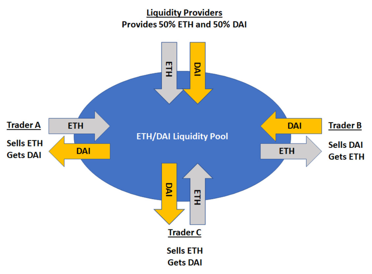

# 0.How to Defi
---
对于How to defi的读书笔记

# Defi活动
我的理解就是Defi可以做的一些事情？一些类似于现实金融市场的事情。

## Yield Farming

收益耕作制的是将资本分配给Defi协议从而获得回报。

大多数的Defi是点对点的金融应用，所获得的资本被用来像油壶提供服务，然后向用户收取的费用在资本提供者和协议之间共享，资本提供者得到的费用就是内在的收益。

在Crypto中，我们将投资者称为yield farmers，把收益率机会叫做农场，例子有：
- 交易所
- 贷款
- 保险
- 期权
- 合成资产

## 流动性挖矿(Liquidity Mining)
流动性挖矿指的是用协议的原生代币以换取投资的奖励计划。这些代币通常带有治理权，并有可能从DeFi协议中累积现金流。

如果设计得当，流动性挖矿计划将会在短时间内引导大量的流动性，尽管这回稀释代币的所有权。

最常见的流动性挖矿计划形式是在去中心化交易所提供原生代币流动性，基础代币如ETH、WBTC或美元稳定币。这种计划激励了围绕协议的原生代币创造流动性，并使用户能够在去中心化交易所轻松交易这些代币。
> 2020年8月，去中心化交易所SushiSwap推出了其名为SUSHI的治理代币，并希望引导SUSHI和ETH之间的流动性。该团队提出将免费的SUSHI代币奖励给任何在SushiSwap上提供SUSHI/ETH交易对流动性的人。
> 用户将不得不以相等的比例提供SUSHI和ETH。我们假设一个用户拥有价值1000美元的ETH，并希望参与这个流动性采矿计划，以赚取SUSHI代币。该用户首先将其一半的ETH兑换成SUSHI.然后他将价值500美元的SUSHI和价值500美元的ETH注入SUSHI-ETH流动性池。他将获得SUSHI-ETH流动性提供者（LP）代币，代表他在流动性池中的份额，然后可以在SushiSwap平台上押注以获得SUSHI代币奖励。
> 注：主要好处是获得sushi代币奖励，主要风险是sushi的在快速被挖出后的市场抛盘导致价格下跌风险
>

## 空投(AirDrop)
空投本质上是免费分发的代币。项目将空头作为营销的一部分。一些项目会进行空投用来奖励那些和协议互动的早期用户，每个协议都会有一个标准来筛选空头的接受者，比如达到一定的互动时间或者使用的最低jin he

## IDO
就是IPO吧我觉得，随着DEX的普及，项目可以直接面向客户，而不需要从交易所上市，如何如何将代币公平的分给用户，仍然是一个大工程，几个流行的方式有：
### IBCO
INitial Curve Offering 初始粘合曲线发行，是为了防止抢跑而产生的一种类型。从本质上讲随着越多的投资者向它提供资金，代币的价格就会不断上涨。

同时出资的时间不重要，所有的投资者都会根据相同的最终结算价格来进行结算。

### LBP
Liquidity Bootstrapping Pool，流动资金引导池， 使用Balancer的智能池托管，流动性引导池（LBP）是项目使用可配置的自动做市商出售代币的一种方式。

### IFO
初始农场发行(IFO，Initial Farm Offering)，初始农场发行（IFO）是由PancakeSwap首次推出的，它允许用户将他们的流动性提供者（LP）代币作为赌注来交换项目的代币。通过使用溢出机制，用户可以按自己的意愿入股，或多或少。在超额认购的情况下，任何多余的代币都会返还给投标人。PancakeSwap上的IFO使用CAKE-BNB LP代币，项目收到BNB代币以换取其新铸的协议代币，而剩余的CAKE代币则被烧毁。

# DEX
DEX是一个平台，可以实现代币的交易和直接交换，而不需要中介机构（即中心化交易所）。你不需要经历 "了解你的客户"（KYC）流程的麻烦，也不会受到管辖范围的限制。

## 种类
DEX一般分为两种：
- 基于订单薄的DEX
- 基于流动性池子的DEXs

### 基于订单薄
基于订单簿的DEXs，如dYdX、Deversifi和Loopring，其操作与CEXs类似，用户可以在他们选择的限价或市场价格上设置买卖订单。主要区别在于，在CEXs中，交易的资产被保存在交易所的钱包里，而对于DEXs，交易的资产被保存在用户的钱包里。

DEXs的订单簿可以是链上或链下的。基于链上订单簿的DEXs将所有订单记录在区块链上。然而，由于高油价，这在以太坊上已经不可行了。也就是说，这在以太坊第二层解决方案（如xDai）或高吞吐量的第一层区块链（如Solana）上仍然可以做到。

基于链外订单簿的DEX有交易订单记录在区块链之外。交易订单一直在链外，直到它们被匹配，这时交易就在链上执行。虽然这种方法具有较低的延迟，但有些人可能会认为，利用这种方法的DEX被认为是半去中心的。

### 基于流动性
基于订单簿的DEXs，如dYdX、Deversifi和Loopring，其操作与CEXs类似，用户可以在他们选择的限价或市场价格上设置买卖订单。主要区别在于，在CEXs中，交易的资产被保存在交易所的钱包里，而对于DEXs，交易的资产被保存在用户的钱包里。

DEXs的订单簿可以是链上或链下的。基于链上订单簿的DEXs将所有订单记录在区块链上。然而，由于高油价，这在以太坊上已经不可行了。也就是说，这在以太坊第二层解决方案（如xDai）或高吞吐量的第一层区块链（如Solana）上仍然可以做到。

基于链外订单簿的DEX有交易订单记录在区块链之外。交易订单一直在链外，直到它们被匹配，这时交易就在链上执行。虽然这种方法具有较低的延迟，但有些人可能会认为，利用这种方法的DEX被认为是半去中心的

# AMM

## 如何运作
与集中式交易所不同，集中式交易所的出价和要价订单放在订单簿上，AMMs没有任何订单簿。相反，它依靠的是流动性资金池。流动性池本质上是持有两个或更多的代币的储备，这些代币存在于DEX的智能合约中，可供用户随时交易。

## 分类

### 恒定乘积AMM
公式: `x * y = k`

恒定乘积做市商公式首先由Uniswap和Bancor推广，是市场上最流行的AMM。绘制时，它是一条凸形曲线，其中x和y代表流动性池中两个代币的数量，而k代表乘积。该公式有助于根据每个代币的可用数量，为两个代币创造一个价格范围。

为了保持k不变，当x的供应增加时，y的供应必须减少，反之亦然。因此，所产生的价格本质上是不稳定的，因为交易的规模可能会影响到与池子规模有关的价格。大额交易造成的较高滑点可能会出现无常的损失。

### 恒定和做市商公式
公式: `x + y = k `

恒定和做市商公式在绘制时形成一条直线。它是零滑点交易的理想模型，但不幸的是，它不能提供无限的流动性。这个模型是有缺陷的，因为当报价与其他地方交易的资产的市场价格不同时，它就会出现套利机会。套利者可以耗尽流动性池中的全部储备，不再为其他交易者留下可用的流动性。这种模式不适合大多数AMM使用案例。

### 恒定平均值AMM
恒定平均值做市商公式，或者也被称为"价值函数"，是由Balancer创造并使之流行的。它允许流动性池中有两个以上的代币，并允许池子以超出标准50/50分布的比例添加不同的代币。这允许对池子里的不同资产进行可变的暴露，并使流动性池子里的任何资产之间的交换成为可能。

### 稳定交换公式
该公式是恒定乘积与恒定和公式的混合体。它是由Curve Finance推广的。

当投资组合相对平衡时，交易发生在恒定和曲线上，而当不平衡时则切换到恒定乘积曲线上。这允许较低的滑点和无常损失，但只适用于具有类似价值的资产，因为所需交易范围的价格总是接近于1。例如，这对稳定币（DAI和USDC）和包装资产（wBTC和sBTC）之间的交易会很有用。

# DEX聚合器

DEX聚合器通过汇集不同DEX的流动性来寻找最具成本效益的交易路线。通过在多个流动性池子中路由单一交易，进行大额交易的交易者可以节约gas成本，并尽量减少因流动性低而影响价格的成本。

## 1inch
1inch Network是一个DEX聚合器解决方案，在多个流动性来源中寻找更便宜的汇率。最初的协议结合了Pathfinder算法，在不同市场之间寻找最佳路径。自从在以太坊网络上成立以来，1inch已经扩展到支持Binance智能链和Polygon网络。1inch聚合协议也经历了两次重大更新，自2021年3月以来一直处于v3版本。

## Matcha
Matcha是由0x实验室建立的一个去中心化交易所（DEX）聚合器。Matcha由0x协议提供支持，该协议拥有各种产品，包括共享订单的点对点网络（0x Native Liquidity）和他们专有的API。Matcha从0x API中提取数据，并在所有可用的流动性来源（截至2021年5月31日有20多个）中有效地路由订单。

与其他DEX聚合器不同，Matcha在整个交易体验中利用了链上和链下组件的组合。0x API找到最具成本效益的交易路径（包括gas成本），如果发现对交易者更有益，Matcha甚至可以在多个流动性来源之间自动分割单个订单。

## Paraswap
ParaSwap于2019年9月首次开发，使用自己的路由算法Hopper。ParaSwap检查所有支持的交易所的给定货币对的汇率，并显示每个货币对的有效汇率（考虑到滑点）

# 去中心化的借贷

主要介绍了一下目前的借贷市场

# 稳定币和稳定资产
介绍了一下稳定币，和稳定币的几种类型以及稳定资产的几种类型

# 去中心化的保险
没啥好说的

# 预言机和数据聚合器

DeFi是由智能合约驱动的。有时，智能合约工作所需的真实世界数据并不存储在区块链上，如天气状况或交通信息。需要有协议来处理这一差距，将链外数据转发到区块链上，以便智能合约与数据互动。

链外信息是DeFi的一个组成部分，应该始终是有效和准确的。错误的数据会给特定的项目造成混乱，并给DeFi带来重大问题。然而，我们如何确保所提供的数据始终是准确的，可以信任的？

一些协议旨在通过将数据传输和广播到区块链上，从而实现不被操纵或篡改。这大多是通过投票或共识机制来实现的，验证者就最准确的数据达成一致。如果没有预言机或数据聚合器作为主要的“真实数据来源”，坏的行为者可以利用虚假信息来操控毫无戒心的用户。

## Oracle协议
预言机充当了链下数据和区块链之间的桥梁，或者是为没有内部数据源的协议提供数据引用服务。这些预言机将外部信息传递到区块链，以供 DeFi生态系统中的智能合约或Dapp进行验证和执行。

Chainlink是用于构建去中心化预言机网络的框架和基础设施，可将任何区块链网络上的智能合约安全地连接到外部数据资源和链下计算。每个预言机网络都由独立且抗女巫攻击的节点运营商保护，这些运营商从众多链下数据提供商那里获取数据，将信息聚合成一个单一的值，并在链上交付以供智能合约执行。

Chainlink的主要功能之一是通过其价格反馈提供最准确的资产价格，这些价格可以整合到区块链协议中，用于特定的用例。例如，在期权和期货合约到期结算时，以及资产被用作贷款抵押品时，资产价格是非常重要的。Chainlink的服务还包括用于跨链代币的 "储备证明 "参考源和用于链上游戏应用的可验证随机函数。