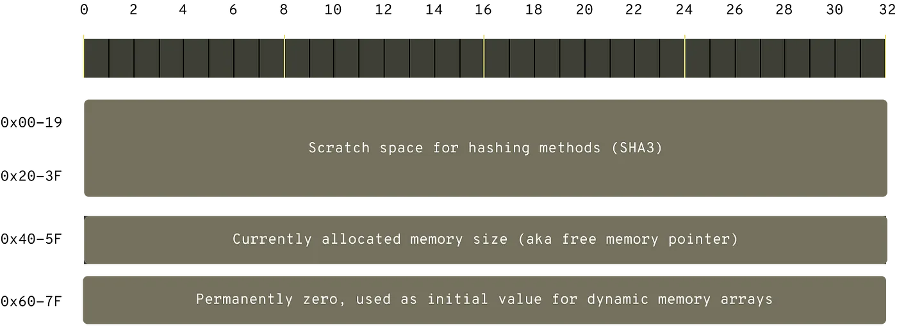

## 简述

Solidity中的数组存储位置有三种：
1. `storage`： 存储在链上，合约中的状态变量默认都是`storage`
2. `memory`： 存储在内存中，不上链函数参数和临时变量一般都是`memory`。
3. `calldata`： 和`memory`类似，存储在内存中，不上链，不同的是`calldata`不能修改，一般用于函数的参数。

不同的存储位置他们的`Gas`成本不同。

# Todo
# Dive It

## Memory

在`Solidity`中内存是线性的。内存中每个字节都可以通过索引来直接访问。内存中每个字都是连续的32个字节，与`slot`的大小相同，并且字是一个接一个的沿着直线排列的，`solidity`保留四个32位字节槽来供内部使用.

位于内存中的变量只能在定义它们的函数范围内访问（通过 `Solidity`）。

请记住，内存永远不会被释放，因此可以通过简单地从分配它的内存位置读取变量来访问（即通过内联汇编）

## Calldata

## stroage

## refer
https://blog.smlxl.io/solc-internals-part-2-data-locations-2f6517aeb154

https://www.wtf.academy/docs/solidity-101/DataStorage/